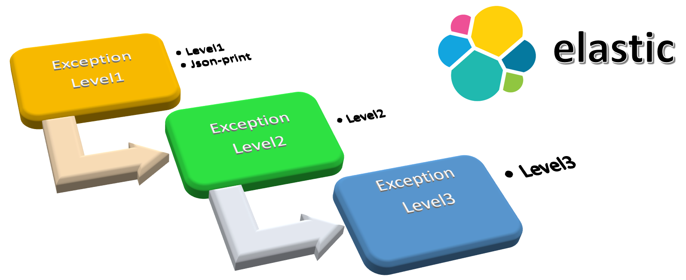

# ECS-EXCEPTIONS

 This project implements the standard <a href="https://www.elastic.co/guide/en/ecs-logging/overview/current/intro.html">Elastic Common Schema</a>  to print logs in JSON format 
it allows perform a better way to track errors in the systems 
 

The middleware uses the <a  href="https://refactoring.guru/design-patterns/chain-of-responsibility"> Chain of Responsibility pattern</a> to perform actions depending on 
the level of exception.

## Requirements
+ ***Java 17*** The basic example was build in this version of Java.  